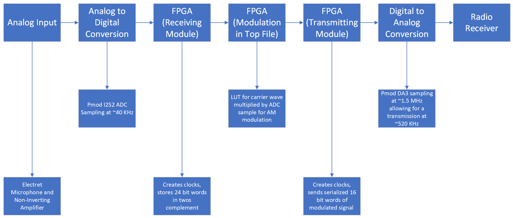
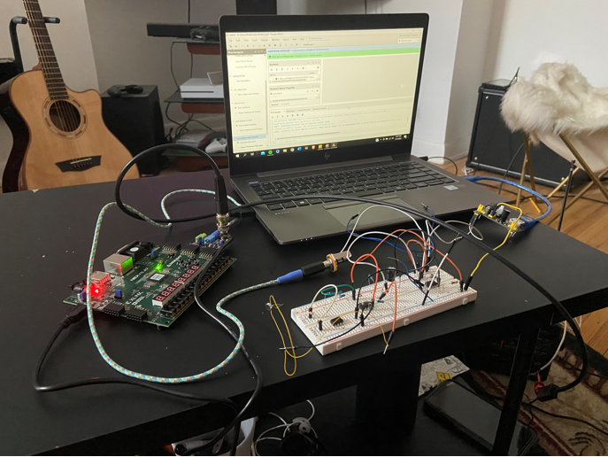
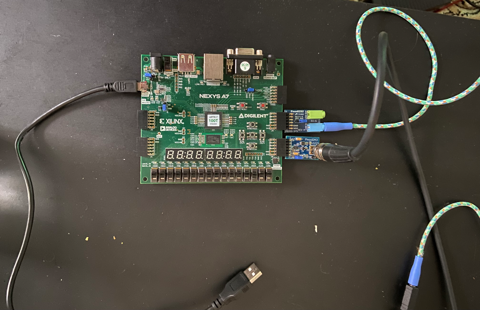
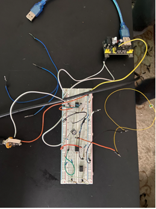

# AM_Transmitter
Artix-7 Based FPGA Radio Transmitter

In this project, first an analog input of some sort is required whether it be a microphone or guitar signal. We used waveform generators, an electret microphone, and an electric guitar in combination with non-inverting amplifier circuits for our analog input. This analog input is connected to the ADC component on our Pmod I2S2 via an auxiliary cable which then samples the analog input and turns it into discrete samples. These discrete samples are read in by our FPGA, and processed using VHDL. It is first processed by the receiving (RX) module which reads in the serialized samples and passes it onto our top file. The top file holds a lookup table which contains discrete samples of one period of a sine wave. This allows us to multiply our received analog signal samples with the sine wave lookup table to create an Amplitude Modulated (AM) signal. This is done with precise timings so we can control the carrier frequency of the modulated signal, which comes in handy when trying to tune to the frequency at which we are broadcasting. This modulated signal then goes to our transmitting (TX) VHDL module, that then sends the data to our DAC in serial format. The DAC will then make our modulated signal an analog signal which passes through our antenna. This wave will then propagate from the antenna outwards, and we can then receive it on a radio receiver at our broadcasting frequency.

Our VHDL modules and testbench can be found [here](/radio3/radio3.srcs/sources_1).

Below is a block diagram describing our transmitter:

Below are pictures of the final project:  

Below is a picture of our testbench, which was mainly used to test the timings for all our components:
.png)

Below is a video of our transmitter in action:
[video](https://github.com/athakkar1/AM_Transmitter/assets/96598825/30c30c8c-5aab-4813-ae89-f5aebbb0f6e8)

